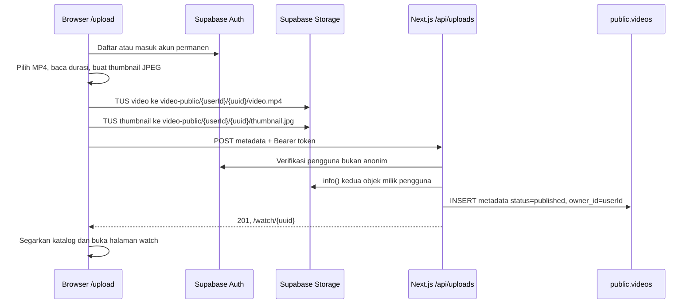

# Flow teknis upload dan watch video

Dokumen ini menjelaskan implementasi yang berjalan di Next.js Pages Router. Ada dua mode upload: **Supabase** untuk video publik dan **demo lokal** untuk percobaan tanpa layanan eksternal.

## Prasyarat Supabase

1. Isi `NEXT_PUBLIC_SUPABASE_URL` dan `NEXT_PUBLIC_SUPABASE_ANON_KEY` di `.env.local`.
2. Jalankan ulang [schema.sql](../supabase/schema.sql) di SQL Editor. Skrip menambah kolom `owner_id` dan `status` pada `public.videos`, membuat bucket publik `video-public`, serta policy RLS untuk kreator.
3. Aktifkan login email/kata sandi di Supabase Authentication. Jika konfirmasi email aktif, pengguna harus mengonfirmasi alamatnya sebelum masuk. Sesi penonton anonim tetap boleh untuk aktivitas menonton, tetapi **tidak boleh upload**.
4. Pastikan batas ukuran Storage project mengizinkan file sampai 100 MB. Batas bucket di skrip adalah 100 MB.

## Upload Supabase

- Tombol **Buat konten → Upload video** membuka `/upload`. Form menerima MP4 maksimal 100 MB, judul 3–120 karakter, deskripsi sampai 5.000 karakter, dan kategori katalog. Browser membaca metadata pemutar untuk durasi dan mengambil frame video menjadi thumbnail JPEG 640×360.
- File ditransfer langsung ke Storage dengan TUS (`tus-js-client`), chunk 6 MB, retry, progress, dan kesempatan melanjutkan upload yang sempat terputus. Byte video **tidak** melewati API Route Next.js. Path objek memakai UUID dan folder ID pengguna; RLS Storage menolak sesi anonim dan folder pengguna lain.
- `POST /api/uploads` hanya menerima ID dan metadata. Endpoint menghitung sendiri path objek dari pengguna terverifikasi, memeriksa ukuran serta MIME kedua objek melalui `info()`, lalu memasukkan row `public.videos`. Policy database memaksa `owner_id = auth.uid()` dan `is_anonymous = false`. Response berhasil: `{ "id": "<uuid>", "watchUrl": "/watch/<uuid>" }`.
- Jika transfer atau publikasi gagal, form menampilkan alasan dan dapat dicoba lagi dengan ID yang sama. Objek yang sudah selesai diunggah dilewati saat retry. **Belum ada job pembersihan objek yatim** bila pengguna meninggalkan form sebelum publikasi.
- Bucket `video-public` bersifat publik untuk pemutaran tanpa URL yang kedaluwarsa. Karena itu file dapat diakses bila URL objek diketahui bahkan sebelum metadata diterbitkan. Implementasi ini belum memproses ulang codec, memindai konten, membuat HLS, atau memoderasi unggahan. Gunakan MP4 yang dapat diputar browser; proses media server terpisah diperlukan sebelum skala produksi.

## Upload demo lokal

Ketika Supabase tidak dikonfigurasi, `/upload` otomatis memilih **mode demo lokal**. Saat Supabase tersedia, pengguna juga bisa memilih **Coba di browser ini**. Browser menyimpan file MP4 di IndexedDB (`youtube-clone-media`) dan metadata beserta thumbnail kecil di `localStorage` (`youtube-clone-local-uploads`). `AppStateProvider` menggabungkan metadata lokal dengan katalog API; halaman watch mengambil Blob dari IndexedDB dan membuat object URL untuk pemutar.

Mode lokal tidak mengirim video ke server, tidak dapat dibuka dari perangkat/browser lain, dan bergantung pada kuota penyimpanan browser. Jika file IndexedDB terhapus, halaman watch menampilkan pesan bahwa media tidak tersedia. `/api/videos` hanya berisi katalog Supabase atau fixture; video lokal hanya muncul dalam UI browser yang menyimpannya.

## Watch video

1. `GET /watch/:id` memakai `getServerSideProps` dan `listVideos()` untuk video Supabase/fixture. ID lokal (`local-<uuid>`) diberi shell SSR, kemudian metadata dan file dimuat di browser. ID server yang tidak ditemukan menghasilkan 404.
2. `GET /api/videos` membaca row `public.videos` dengan `status = published`; jika Supabase tidak dikonfigurasi, kosong, atau gagal, katalog fixture digunakan. `GET /api/videos/:id` memakai sumber yang sama.
3. Pemutar HTML5 meminta `video_url` Storage secara langsung, `/demo-video.mp4` untuk fixture, atau object URL IndexedDB untuk upload lokal. Thumbnail yang disimpan ditampilkan sebagai poster.
4. Saat halaman dibuka, `AppStateProvider.addHistory()` mencatat histori. Suka, simpan, subscription, dan komentar memakai API Supabase bila sesi tersedia; mode dummy menyimpan aktivitas di browser. View count yang tampil masih teks statis dan belum bertambah saat diputar.

## Batas implementasi dan pengembangan berikutnya

- Format saat ini hanya MP4 dan thumbnail JPEG otomatis. Pemeriksaan server baru memastikan metadata MIME/ukuran Storage, belum memverifikasi isi codec atau keamanan media.
- Katalog belum memiliki status draft, proses transcoding, moderasi, edit/hapus video, daftar unggahan kreator, kuota per akun, atau pembersihan objek gagal. Untuk produksi, gunakan bucket sumber privat dan worker media sebelum mempublikasikan output.
- Video demo lokal tidak tersedia lewat API atau SSR penuh. Untuk berbagi lintas perangkat, gunakan mode Supabase.
- Hitung view setelah pemutaran dimulai dengan endpoint dan deduplikasi server; saat ini histori tercatat ketika halaman watch dibuka.

## Pemeriksaan

Jalankan `npm run lint` dan `npm run build`. Tanpa kredensial Supabase, uji `/upload` dalam mode lokal dan pastikan file muncul di beranda serta dapat diputar pada `/watch/local-...`. Untuk uji Supabase, jalankan skema, daftar akun permanen, unggah MP4, lalu periksa objek Storage, row `public.videos`, katalog, dan watch dari browser lain. Pastikan akun anonim tidak dapat menulis ke bucket maupun tabel.
