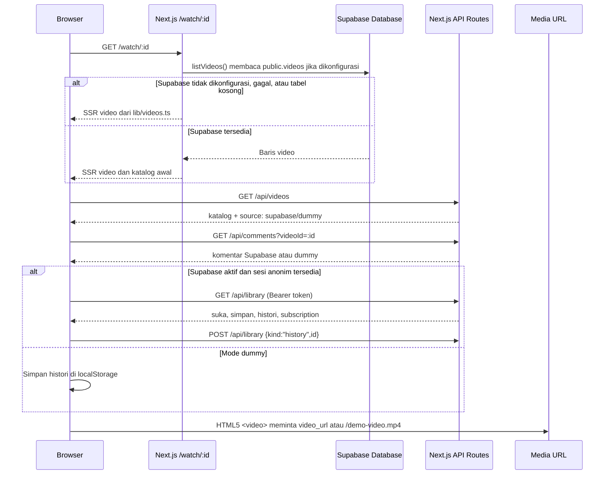

# Flow teknis upload dan watch video

Dokumen ini menjelaskan perilaku aplikasi pada **4 Oktober 2026** dan rancangan implementasi upload berikutnya. Project memakai Next.js **Pages Router**, API Routes, Supabase Auth/Database, dan media demo lokal. Kontrak pada bagian **Rancangan upload** belum tersedia sebagai endpoint atau tabel di aplikasi.

## Status saat ini

| Area | Sudah ada | Belum ada |
| --- | --- | --- |
| Katalog | `GET /api/videos`, `GET /api/videos/:id`, sumber Supabase dengan fallback dummy | Paginasi dan pencarian di database |
| Watch | SSR `/watch/:id`, pemutar HTML5, rekomendasi, komentar, suka/simpan/subscribe/histori | Media unggahan pengguna, view count aktual, transcoding/HLS |
| Upload | Tombol **Buat konten** menampilkan pesan placeholder | Halaman/form upload, endpoint upload, bucket Storage, worker media, status publikasi |
| Auth | Sesi anonim untuk aktivitas penonton saat Supabase aktif | Login kreator permanen dan otorisasi upload |

File utama: [`pages/watch/[id].tsx`](../pages/watch/[id].tsx), [`lib/server/videos.ts`](../lib/server/videos.ts), [`components/app-state.tsx`](../components/app-state.tsx), [`pages/api/library.ts`](../pages/api/library.ts), [`pages/api/comments.ts`](../pages/api/comments.ts), dan [`supabase/schema.sql`](../supabase/schema.sql).

## Flow watch yang sudah berjalan



1. `getServerSideProps` di `pages/watch/[id].tsx` memanggil `listVideos()` pada setiap permintaan. ID yang tidak ditemukan menghasilkan **404**. `listVideos()` membaca `public.videos` dari Supabase dan beralih ke 16 video dummy jika URL/key belum tersedia, query gagal, atau tabel kosong.
2. Setelah hidrasi, `AppStateProvider` meminta `/api/videos`. Jika `source` adalah `supabase`, browser membuat/memulihkan sesi anonim, mengambil `/api/library`, dan menyinkronkan aktivitas. Jika tidak, aktivitas tetap di `localStorage` dengan key `youtube-clone-state`.
3. Saat state siap, halaman memanggil `addHistory(video.id)`. **Saat ini histori tercatat ketika halaman dibuka, bukan setelah video benar-benar diputar.** Dalam mode Supabase, aksi ini dikirim ke `POST /api/library` dan disimpan di `public.watch_history` milik pengguna.
4. Komentar dibaca dari `/api/comments?videoId=:id`. Komentar baru dikirim ke `POST /api/comments` dengan bearer token bila sesi Supabase aktif. Dalam mode dummy, komentar baru hanya hidup di state halaman.
5. Pemutar memakai `<video controls>` dengan `poster=thumbnail` dan `src=video.videoUrl`; jika URL belum ada, pemutar memakai `/demo-video.mp4`. Browser mengambil media langsung dari URL tersebut; Next.js tidak mem-proxy byte video.

### Kontrak read dan interaksi saat ini

| Endpoint | Input utama | Hasil penting |
| --- | --- | --- |
| `GET /api/videos` | Tidak ada | `{ videos: Video[], source: "supabase" \| "dummy", warning? }` |
| `GET /api/videos/:id` | ID video | `{ video, source, warning? }`; **404** jika tidak ada |
| `GET /api/comments?videoId=:id` | ID video | `{ comments, source }` |
| `POST /api/comments` | `{ videoId, text }`, bearer token untuk Supabase | Komentar baru; **400** untuk input salah, **401** untuk sesi tidak valid |
| `GET /api/library` | Bearer token untuk Supabase | `{ source, state: { liked, saved, history, subscriptions } }` per pengguna |
| `POST /api/library` | `{ kind: "like" \| "save" \| "history" \| "subscribe", id, active? }` | Menambah/menghapus preferensi atau memperbarui histori |

`public.videos` saat ini menyimpan nilai tampilan seperti `views`, `uploaded`, `duration`, dan `likes` sebagai **teks**. Angka tersebut berasal dari seed/demo; memutar video belum menambah view count. `GET /api/videos/:id` tersedia untuk klien lain, sedangkan halaman watch SSR memakai `listVideos()` langsung di server.

## Rancangan flow upload

**Prasyarat:** implementasikan login kreator permanen. Sesi anonim yang sekarang dibuat oleh `getAccessToken()` hanya untuk aktivitas penonton. Pengguna anonim juga memakai role Postgres `authenticated`, sehingga policy upload harus memeriksa klaim `is_anonymous`, bukan hanya role. Lihat [Supabase Anonymous Sign-Ins](https://supabase.com/docs/guides/auth/auth-anonymous).

Untuk video besar, gunakan **TUS resumable upload langsung dari browser ke Supabase Storage**. Supabase merekomendasikannya untuk file di atas 6 MB, jaringan tidak stabil, atau kebutuhan progress. API Route hanya mengelola metadata dan otorisasi; byte video tidak melewati Next.js. Ini juga menghindari batas body parser default API Routes. Rujukan: [Supabase resumable uploads](https://supabase.com/docs/guides/storage/uploads/resumable-uploads), [Next.js API Routes](https://nextjs.org/docs/pages/building-your-application/routing/api-routes).

```mermaid
sequenceDiagram
    participant C as Kreator / Browser
    participant A as Next.js API
    participant DB as Supabase Database
    participant S as Supabase Storage
    participant W as Worker media

    C->>A: POST /api/uploads/init (metadata + token kreator)
    A->>A: Validasi auth permanen, metadata, kuota
    A->>DB: Buat upload draft dan path milik kreator
    A-->>C: uploadId, bucket, objectPath, endpoint TUS
    C->>S: TUS upload langsung (JWT, progress, resume)
    S-->>C: Upload selesai
    C->>A: POST /api/uploads/:id/complete
    A->>S: Verifikasi object, ukuran, path, owner
    A->>DB: status = processing
    A->>W: Jadwalkan inspeksi/olah media
    W->>S: Validasi codec, buat thumbnail/output publik
    W->>DB: status = ready, simpan path hasil
    C->>A: POST /api/uploads/:id/publish
    A->>DB: Publikasikan video; status = published
    A-->>C: URL /watch/:id
```

### Langkah dan kontrak yang diusulkan

| Tahap | Kontrak yang perlu dibuat | Perilaku server/client |
| --- | --- | --- |
| 1. Pilih file | Halaman `pages/upload.tsx` | Terima judul, deskripsi, kategori, file video, thumbnail opsional. Validasi awal ukuran/ekstensi untuk UX; server tetap memvalidasi ulang. |
| 2. Inisialisasi | `POST /api/uploads/init` | Verifikasi bearer token dengan Supabase Auth, tolak akun anonim, cek batas ukuran/jenis file, buat UUID `uploadId` dan record draft, lalu set `uploading` saat transfer dimulai. Balas bucket dan path unik, misalnya `<userId>/<uploadId>/source.mp4`. |
| 3. Transfer | Browser → Supabase Storage TUS | Upload langsung ke bucket **private** `video-source`, pakai access token kreator; tampilkan progress, retry, pause/resume. Jangan kirim file melalui `pages/api`. |
| 4. Konfirmasi | `POST /api/uploads/:id/complete` | Pastikan pemanggil pemilik upload. Cek objek benar-benar ada dan metadata server Storage cocok; transisi `uploading → processing` harus idempoten. Respons **202** saat proses berjalan. |
| 5. Olah media | Worker/queue di luar request API | Periksa isi/codec sebenarnya, durasi, resolusi, dan hasilkan thumbnail. MVP dapat menerima MP4 H.264/AAC yang tervalidasi; tahap berikutnya dapat menyiapkan format adaptif seperti HLS. File gagal tetap private dan `status=failed`. |
| 6. Publikasi | `POST /api/uploads/:id/publish` | Hanya pemilik ketika `status=ready`; buat/update record katalog `public.videos`, isi `video_url`/thumbnail publik, lalu ubah status menjadi `published`. Respons URL `/watch/:id`. |

Contoh payload **rancangan**, belum endpoint aktif:

```http
POST /api/uploads/init
Authorization: Bearer <creator_access_token>
Content-Type: application/json

{
  "filename": "perjalanan-bali.mp4",
  "mimeType": "video/mp4",
  "sizeBytes": 104857600,
  "title": "Perjalanan Bali",
  "description": "Catatan perjalanan singkat",
  "category": "Travel"
}
```

Respons: `{ "uploadId": "<uuid>", "bucket": "video-source", "objectPath": "<userId>/<uploadId>/source.mp4", "tusEndpoint": "<storage-host>/storage/v1/upload/resumable" }`. ID dan path dibuat server; client tidak memilih path bebas. Untuk video publik, simpan output final di bucket publik terpisah, misalnya `video-public`, lalu gunakan URL publik sebagai `video_url`. Untuk video privat, gunakan URL bertanda tangan dengan masa berlaku dan kebijakan akses khusus. [Supabase menjelaskan perbedaan bucket publik dan privat](https://supabase.com/docs/guides/storage/buckets/fundamentals).

Sketsa konfigurasi transfer di browser setelah `init` (membutuhkan paket `tus-js-client`, belum dipasang):

```ts
const upload = new tus.Upload(file, {
  endpoint: tusEndpoint,
  headers: { authorization: `Bearer ${creatorAccessToken}` },
  metadata: { bucketName: bucket, objectName: objectPath, contentType: file.type },
  chunkSize: 6 * 1024 * 1024,
  retryDelays: [0, 3000, 5000, 10000],
  onProgress(bytesSent, bytesTotal) { setProgress(bytesSent / bytesTotal); },
  onSuccess() { void completeUpload(uploadId); },
});
```

Sebelum `upload.start()`, cari upload TUS sebelumnya dan resume jika ada. Tetap gunakan path objek baru untuk setiap upload dan jangan mengaktifkan overwrite. Supabase saat ini mensyaratkan chunk TUS **6 MB** dan URL resumable dapat kedaluwarsa setelah 24 jam. [Supabase resumable uploads](https://supabase.com/docs/guides/storage/uploads/resumable-uploads).

### Skema dan policy yang harus ditambah sebelum upload diaktifkan

- Buat tabel staging `video_uploads`: `id`, `owner_id`, `status`, `title`, `description`, `category`, `source_path`, `thumbnail_path`, `size_bytes`, `mime_type`, `duration_seconds`, `error_message`, `created_at`, `updated_at`. Status: `draft → uploading → processing → ready → published`, dengan cabang `failed`/`cancelled`. Simpan row draft terpisah dari `public.videos` agar katalog saat ini tidak mempublikasikan video belum selesai.
- Tambahkan `owner_id`, `status` (dengan migrasi row lama ke `published`), dan metadata numerik (`view_count`, `duration_seconds`, `published_at`) ke `public.videos` saat pipeline siap. `listVideos()` dan policy `SELECT` saat ini membaca **semua** row; ubah keduanya agar hanya video `published` yang tampil di katalog. Setelah itu, `getServerSideProps` sebaiknya query **satu video berdasarkan ID**, bukan seluruh katalog setiap kali watch dibuka.
- Buat bucket `video-source` private dengan batas ukuran/MIME, serta bucket `video-public` untuk output terbit. Policy `storage.objects` untuk upload harus membatasi `bucket_id`, folder pertama = `auth.uid()`, dan klaim `is_anonymous = false`. Tambahkan policy kepemilikan pada `video_uploads`; pengguna lain tidak boleh melihat atau mengubah draft. Supabase Storage menolak upload tanpa policy yang sesuai. Rujukan: [Storage Access Control](https://supabase.com/docs/guides/storage/security/access-control).
- Jangan gunakan `service_role` di browser. Bila worker memerlukan hak istimewa untuk memindahkan/menyalin media, simpan secret hanya di lingkungan server/worker. Hapus objek sumber yang gagal, dibatalkan, atau sudah melewati masa retensi melalui job pembersihan; jangan menghapus baris `storage.objects` secara langsung. [Supabase Storage schema](https://supabase.com/docs/guides/storage/schema/design).

## Flow watch setelah upload tersedia

1. Endpoint publik hanya mengembalikan video `published`. `GET /watch/:id` memakai metadata terbaru, thumbnail hasil proses, dan `video_url` publik. Jika video `draft`, `processing`, `failed`, atau sudah dihapus, penonton mendapat **404**; pemilik melihat statusnya di dashboard upload.
2. `<video>` memuat file dari Storage/CDN secara langsung. Pemutar tetap memakai kontrol browser untuk MVP. Jika output HLS ditambahkan, pilih player yang mendukung HLS di browser yang membutuhkannya.
3. Pindahkan pencatatan histori dari efek saat halaman dibuka ke event pemutaran (`playing`/ambang durasi). Buat endpoint view terpisah dengan aturan deduplikasi dan kenaikan counter atomik di database; jangan mempercayai hitungan yang dikirim client.
4. Komentar dan aksi library tetap memakai endpoint sekarang. Periksa status `published` pada operasi tulis agar tidak ada interaksi ke video draft/terhapus.

## Penanganan kegagalan dan uji penerimaan

| Kondisi | Hasil yang diharapkan |
| --- | --- |
| Supabase belum dikonfigurasi | Beranda/watch memakai data dummy; upload dinonaktifkan dengan pesan yang jelas. |
| Token kreator anonim/kedaluwarsa | `init`, `complete`, dan `publish` menolak permintaan; tidak ada objek publik atau metadata terbit. |
| Jaringan putus di tengah upload | TUS melanjutkan transfer yang sama selama URL resumable masih berlaku; draft tidak dipublikasikan. |
| Object Storage tidak sesuai metadata atau codec gagal | Status `failed`, alasan tercatat, file tetap private dan dapat dibersihkan. |
| `complete`/`publish` dikirim ulang | Hasil tetap konsisten, tidak membuat dua video atau menggandakan objek. |
| Video berhasil terbit | Katalog dan `/watch/:id` mengembalikan metadata, thumbnail, serta video yang dapat diputar; pengguna lain tidak bisa mengubahnya. |
| ID video tidak ada/tidak publik | Watch memberi **404**; API tidak membocorkan draft. |

Checklist implementasi: uji policy RLS untuk **kreator, pengguna anonim, dan pengguna lain**; uji upload besar/putus-sambung; verifikasi byte tidak melewati Next.js; uji status draft sampai published; uji seek/range media melalui URL Storage/CDN; uji fallback dummy tetap berjalan tanpa Supabase.
